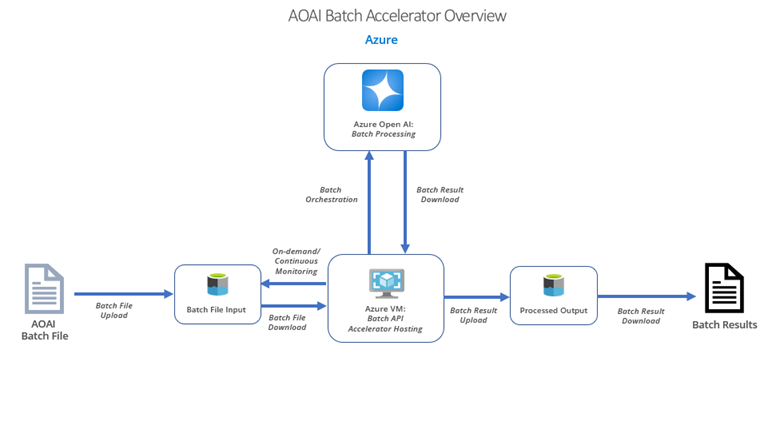

<h1>Azure OpenAI Batch Accelerator</h1>
<h2>Disclaimer:</h2>This is a reference implementation of the Azure OpenAI Batch API designed to be extended for different use cases. 
 This code is <b>NOT</b> intended for production use but instead as a starting point/reference implenentation of the Azure OpenAI (AOAI) Batch API. The code here is provided <b>AS IS</b>, you assume all responsibility (e.g., charges) from running this code. Testing in your environment should be done before running large use cases. Lastly, this is a work in progress and will be updated frequently. Please check back regularly for updates. 
 <h1>Background & Overview</h1>
 This accelerator is designed to help users to quickly start using the Azure OpenAI Batch API. An overview of how the accelerator works is shown below:
 
 
 
 Key features of the accelerator are:
  
 
 1. Automated Batch Job Submission and Creation
 2. Multi-threaded Async Processing to Reduce Overall Processing Time
 3. Automated Error Tracking
 4. Multi-directory Hierarchy Support
 5. Configurable Micro-batch support
 6. Automated Post-job Cleanup
    
  
 For more details, including a demo video of the accelerator and a detailed data flow diagram, please see the presentation located at: 
 
 
 
<h1>Installation & Setup</h1>
<i>Environment:</i>  

1. Python 3.11 (or higher)
2. Pip
3. An Azure Data Lake Storage (v2) account
4. An Azure OpenAI deployment

 <i>The following pip packages are required:</i> 
1. azure-storage-file-datalake 
2. openai
3. tiktoken
4. requests
5. token-count
6. asyncio
7. aiohttp

In addition to this, it is recommended to install these dependencies in a virtual environment to avoid conflicts (e.g., .venv)
<h2>Connecting AOAI to Azure Storage</h2>
The `Storage Blob Data Contributer` role must be given to the AOAI service's Managed Identity to allow AOAI to access the data in the Azure Storage Account.
<h1>Configuration:</h1>
There are three configuration files required to use this accelerator:

1. `AOAI_config.json` - This file contains the settings for AOAI.
2. `storage_config.json` - This file contains the settings for the Azure Data Lake Storage Account which will hold the input/output of the job.
3. `app_config.json` - This file contains the application configuration settings.
4. `APP_CONFIG` in `runBatch.py` - This variable should be set to point to the `app_config.json` file which defines the app settings. Alternatively, this value can be set as an environment variable in the underlying OS. This will support command line parameter-based input in the future.

Reference templates of these files have been provided in the `templates` directory where <> denote settings that must be filled in. 
Other important settings are:

1. aoai_api_version - This must be set to `2024-07-01-preview` as that's the only API version which supports the Batch API at this time. In the future, different versions can be set here.
2. batch_job_endpoint - This must be set to `/chat/completions`.
3. batch_size - This controls the 'micro batch' size which is the number of files that will be sent to the batch service in paralle. It is set to a recommended value of `10` but can be changed
based on the requirements/file sizes being sent to the batch service.
4. download_to_local - This controls if the files should be downloaded to local to count the number of tokens in a file. Currently this should be set to the default value of `false` but may be used in future versions.
5. input_directory/filesystem - This is the directory and filesystem the code will check for input files, respectively. The default directory setting of `/` assumes no directories in the input filesystem. The current implementation is not recursive; if input files are stored in a directory in the input filesystem/container then it should be specified here.
6. output_directory/filesystem - This is the directory and filesystem the code will write output files, respectively. The default directory setting of `/` assumes no directories in the ouput filesystem. 
7. error_directory/filesystem - This is the directory and filesystem the code will write error files, respectively. The default directory setting of `/` assumes no directories in the error filesystem.
8. continuous_mode - This setting controls how the code is run. If set to `true`, it will continuously check the input directory for files every 60 seconds, taking a snapshot of the files and kicking off a series of batch jobs to process until all files are processed. To stop, press `ctrl+c`. If set to `false` it will only run when executed. 

<h1>Using the accelerator</h1>

1. <b>Input</b>: Upload formatted batch files to the input location specified in the `storage_config.json` configuration file. Once all files are uploaded, start the `runBatch.py` in the code directoy. When run, the code will run continuously or once, depending on the `continuous_mode` setting described above. 
2. <b>Output</b>: The code will create a directory in the `processed_filesystem_system_name` location in `storage_config.json` configuration file for each file processed along with a timestamp of when the file was processed. The raw input file will also be moved to the `processed` directory. In addition, if there are any errors, they will be put in the `error_filesystem_system_name` location, with a timestamp. 
3. <b>Metadata</b>: The output creates a metadata file for each input file which contains mapping information which may be useful for automated processing of results.
4. <b>Cleanup</b>: After processing is complete, the code will automatically process and clean up all files in the input directory, locally downloaded files, and all uploaded files to the AOAI Batch Service.

<h1>Issues</h1>
If you have any problems using this code or would like to see a new feature added, please create a new issue using the 'Issues' tab.

